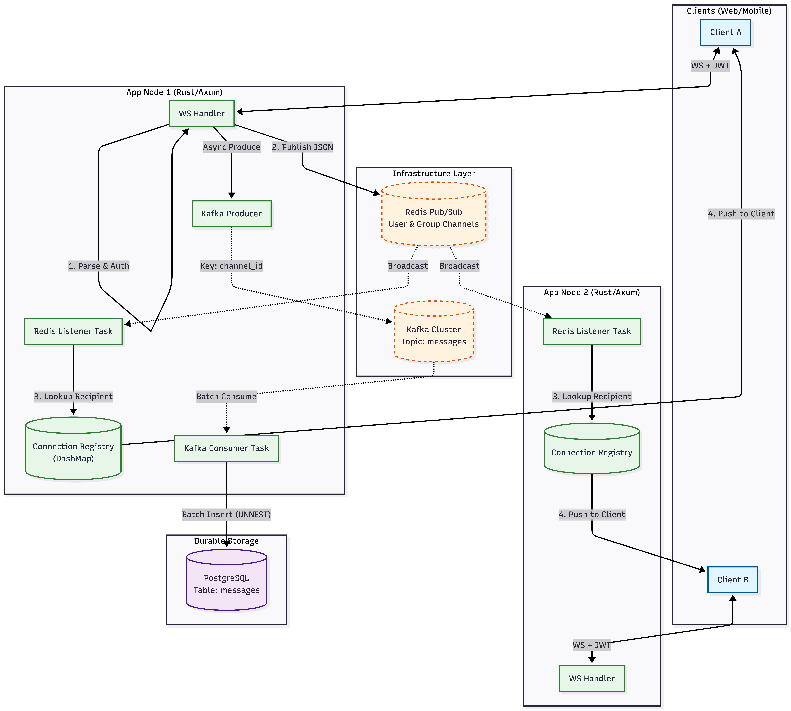

# Yappa-RT ⚡

**High-throughput, multi-tenant real-time infrastructure. Built in Rust. Built to scale.**

DMs. Groups. Communities.
Cross-node fanout via Redis.
Durability via Kafka.
Truth in Postgres.

Zero magic. Just systems.

---

## The Problem

Real-time infra is either:

* 🐢 Slow
* 💥 Not durable
* 🧵 Impossible to scale cleanly
* 🔓 Not multi-tenant safe

We didn’t want another toy chat server.

So we built infrastructure.

---

## The Stack (Deliberate Choices Only)

* Rust
* Axum
* Tokio
* Redis (Pub/Sub fanout)
* Kafka (event durability)
* PostgreSQL (source of truth)
* DashMap (lock-efficient routing)
* JWT (auth at handshake)

No ORM bloat.
No hidden abstractions.
No “we’ll fix it later” architecture.

---

## Architecture

### What this means

* ⚡ Sub-RTT delivery across nodes
* 📦 Durable event streaming
* 📈 Horizontal scaling by default
* 🧠 In-memory routing for hot path
* 🛡 Tenant isolation baked in

---

## Multi-Tenant By Design

Every single layer is scoped by `tenant_id`.

Connections.
Redis channels.
Groups.
Database rows.

No accidental cross-tenant leakage. Ever.

This is SaaS-ready infra.

---

## Message Flow (Hot Path)

**DM**

* Client → Axum
* Build canonical `ServerMessage`
* Publish to `user:{tenant}:{recipient}`
* Fanout via Redis
* Append to Kafka
* Batch insert to Postgres

**Group**

* User joins group
* Publish to `group:{group_id}`
* Registry fans out
* Kafka persists

Real-time delivery ≠ eventual durability.
You get both.

---

## Why Rust?

Because:

* No GC latency spikes
* Predictable memory
* High concurrency
* True async performance
* Production-grade reliability

If you're building infra, you optimize for tail latency — not developer comfort.

---

## Scaling Model

Spin up N instances behind a load balancer.

Each node:

* Maintains local in-memory connections
* Subscribes to Redis patterns
* Produces to Kafka independently

Add nodes. Throughput increases.
No shared memory. No coordination bottlenecks.

That’s the point.

---

## Storage Strategy

Kafka consumer:

* Batches 500 messages / 250ms
* Bulk `UNNEST` inserts
* Indexed for tenant + conversation queries

Write-heavy optimized.
Read-friendly schema.

We don’t fear scale.

---

## Benchmarks

Includes:

* k6 load test suite
* Rust stress client

Because “it works locally” isn’t a strategy.

---

## Who This Is For

* SaaS products
* Community platforms
* Marketplaces
* Internal enterprise tooling
* Startups that don’t want to rewrite infra at 10k concurrent users

---

## Vision

Messaging shouldn’t be your bottleneck.
It should be your leverage.

We’re building the real-time layer modern products deserve.

---

MIT. Fork it. Break it. Scale it.

